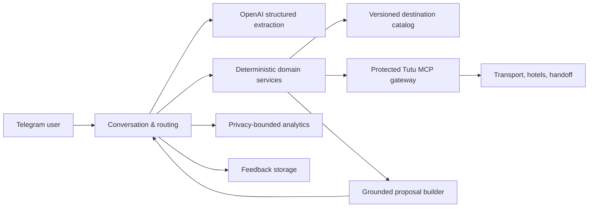

# Tutu Assistant

> AI-native Telegram-ассистент, который превращает идею короткой поездки в проверенный и готовый к бронированию план.

Tutu Assistant сокращает путь от «хочу куда-нибудь на выходные» до конкретного решения: понимает запрос обычным языком, уточняет только действительно недостающие параметры, проверяет транспорт и проживание через Tutu и показывает до трёх совместимых вариантов с понятными компромиссами по цене, времени и удобству.

Проект находится на стадии функционального MVP. Он уже закрывает полный пользовательский путь от намерения до перехода к оформлению, но не проводит оплату и не подтверждает бронирование внутри Telegram.

## Продуктовая ценность

Планирование короткой поездки фрагментировано: пользователь отдельно выбирает направление, ищет дорогу туда и обратно, сопоставляет расписание с событием, подбирает отель и вручную считает бюджет. Чем короче поездка, тем выше цена такой сложности относительно самого путешествия.

Tutu Assistant объединяет этот процесс в один диалог:

- снижает количество действий и переключений между сервисами;
- предлагает целостные поездки, а не набор несвязанных билетов и отелей;
- объясняет, почему вариант рекомендован и чем придётся пожертвовать;
- сохраняет доверие, отделяя подтверждённые цены от оценочных расходов;
- создаёт измеримый handoff в контур бронирования Tutu.

## Что уже работает в MVP

### 1. Поиск по известному направлению — `/newtrip`

Пользователь может одним сообщением описать маршрут, даты, бюджет, состав путешественников, транспорт, отель и ограничения. Бот:

- извлекает параметры из русского естественного языка через OpenAI;
- при необходимости переводит диалог в короткий пошаговый опрос;
- учитывает поезда, самолёты, автобусы и электрички, временные окна и число пересадок;
- поддерживает обязательный, необязательный или запрещённый отель, а также требования к рейтингу, звёздам, завтраку, отмене и удобствам;
- проверяет совместимость дороги, проживания и времени события;
- рассчитывает известную стоимость, сообщает о неполной цене и превышении бюджета;
- ранжирует уникальные варианты как самый дешёвый, с минимумом времени в дороге и оптимальный по балансу;
- показывает вид транспорта, расписание, пересадки, отель, стоимость и ссылку для продолжения оформления на Tutu.

### 2. Discovery: выбор направления — `/ideas`

Для запроса вида «из Москвы куда-нибудь на два дня, без суеты, больше прогулок и истории» бот:

1. определяет намерение, даты, темп, интересы и ограничения;
2. формирует разнообразный shortlist из версионируемого каталога направлений;
3. параллельно проверяет реальную транспортную и гостиничную доступность через Tutu;
4. строит программу активностей на каждый день из контента с источниками;
5. разделяет подтверждённые, оценочные и пока неизвестные расходы;
6. выдаёт до трёх проверенных предложений и позволяет уточнить или оформить выбранное.

Пилотный discovery-каталог содержит 10 направлений из Москвы и расширяется данными, а не изменениями бизнес-логики.

### 3. Диалог и доверие

- `/start`, `/help`, `/cancel` и подсказки команд Telegram;
- редактирование параметров и защита от устаревших inline-кнопок;
- сохранение порядка сообщений внутри одного чата при параллельной обработке разных чатов;
- `/privacy` с понятными правилами обработки данных;
- `/feedback` с категорией и необязательным комментарием;
- `/deletefeedback` для досрочного удаления обращения по выданному receipt ID;
- автоматическое завершение неактивного диалога и очистка его состояния через 30 минут.

## Архитектура



Код построен как модульный монолит с портами и адаптерами:

| Слой | Ответственность |
|---|---|
| `app/domain` | Строгие Pydantic-модели и продуктовые инварианты |
| `app/services` | Планирование, совместимость, бюджет, ranking и resilience без привязки к Telegram |
| `app/ports` | Контракты LLM, каталога, Tutu, аналитики и feedback |
| `app/adapters` | OpenAI Responses API, Tutu MCP, файловый каталог и SQLite |
| `app/bot` | Telegram UX, состояния диалога, callbacks и форматирование |
| `app/main.py` | Composition root, lifecycle и operational wiring |

Такое разделение позволяет независимо менять Telegram, LLM, travel-провайдера, хранилище и аналитику. Асинхронный I/O и bounded concurrency дают разумную стоимость MVP, а stateless domain-слой подготавливает систему к горизонтальному масштабированию.

## AI-контур без неконтролируемой генерации

LLM является обязательной частью продукта, но не источником фактов о доступности и цене:

- официальный OpenAI SDK и Responses API;
- structured outputs с Pydantic-схемами для intent и параметров поездки;
- явные лимиты входа, timeout и отсутствие автоматических SDK retries;
- `store=False`, safety identifier и защита системных инструкций от prompt injection;
- deterministic validation всех дат, ограничений, стоимости и совместимости после LLM;
- narration получает только allowlisted grounded facts с evidence ID;
- при ошибке или неподтверждённом ответе LLM используется безопасный детерминированный fallback;
- версия модели настраивается через окружение без изменения кода.

## Надёжность, безопасность и стоимость эксплуатации

- secrets загружаются только из окружения, представлены как `SecretStr` и редактируются в логах;
- внешние endpoints требуют HTTPS, а передача OpenAI key на custom host запрещена по умолчанию;
- feature flags и общий kill switch позволяют отключать функции без нового релиза;
- circuit breaker, rate budget, semaphores и timeouts защищают Tutu MCP и сам бот;
- capability discovery и schema hash обнаруживают несовместимый контракт провайдера при старте;
- readiness report проверяет каталог, контракт, circuit state и kill switch;
- структурированные логи и allowlisted product events не включают текст пользовательского запроса;
- feedback хранится локально ограниченный срок, использует secure delete и удаляется пользователем;
- bounded analytics queue не замедляет клиентский flow при сбоях телеметрии.

## Качество и поставка

Проект содержит более 280 unit-, contract- и интеграционных тестов, offline eval-наборы для AI-сценариев и coverage gate не ниже 80%. CI проверяет Ruff, форматирование, схемы, fixtures, секреты, зависимости и сборку wheel/container.

Release pipeline публикует multi-platform OCI image в GHCR с SBOM, provenance и attestation. Продвижение в staging/production выполняется по неизменяемому digest, поэтому rollback сводится к повторному promotion известного рабочего образа.

## Быстрый запуск

Требования: Python 3.11+, Telegram bot token и OpenAI API key.

```bash
python3.11 -m venv .venv
source .venv/bin/activate
python -m pip install -r requirements.lock
python -m pip install --no-deps -e .
cp .env.example .env
```

Заполните только локальный `.env`:

```dotenv
TELEGRAM_BOT_TOKEN=...
OPENAI_API_KEY=...
OPENAI_MODEL=gpt-5.6-sol
```

Локально бот работает через polling. Production-контейнер использует Telegram webhook; его URL и secret передаются только через окружение платформы.

```bash
python -m app.main
```

Проверка перед изменениями:

```bash
python -m ruff check app tests scripts
python -m pytest --cov=app
python scripts/run_discovery_evals.py
python scripts/check_secrets.py
```

Для production предусмотрен non-root multi-stage Docker image; локальные feedback-данные должны храниться в persistent volume `/app/var`.

### Google Cloud Run

Release tag `vX.Y.Z` запускает quality gate, публикует один immutable multi-platform image в GHCR и Google Artifact Registry, а затем разворачивает в Cloud Run точный digest через GitHub OIDC — без service-account JSON key.

Production использует request-based billing, `min-instances=0`, один instance для согласованного in-memory диалога и secrets из Google Secret Manager. Временный SQLite не является устойчивым хранилищем Cloud Run, поэтому `/feedback` отключён в cloud-конфигурации до подключения внешней БД.

## Масштабирование после MVP

Текущая архитектура предусматривает развитие по четырём независимым направлениям:

- **Продукт:** новые города отправления и направления, гибкие даты, сохранённые поездки, уведомления об изменении цены, персонализация и групповые сценарии.
- **Коммерция:** сквозная атрибуция handoff → booking, A/B-тесты, партнёрская монетизация, страховки, события и дополнительные travel-сервисы.
- **AI:** автоматизированные live evals, model routing по сложности, semantic cache, многоязычность и обновляемый evidence-backed content pipeline.
- **Платформа:** webhook вместо polling, PostgreSQL/Redis для распределённого состояния, очередь фоновых задач, внешняя observability и горизонтальное масштабирование нескольких bot workers.

Главный принцип развития — расширять каталог, providers и каналы через существующие порты, сохраняя детерминированное ядро принятия решений и измеримый пользовательский результат.

## Границы ответственности

Tutu Assistant помогает подобрать и сравнить поездку. Актуальность цены и наличие подтверждаются провайдером в момент поиска и могут измениться до оформления. Бот не принимает оплату, не покупает билеты и не создаёт бронирование без явного действия пользователя на стороне Tutu.
