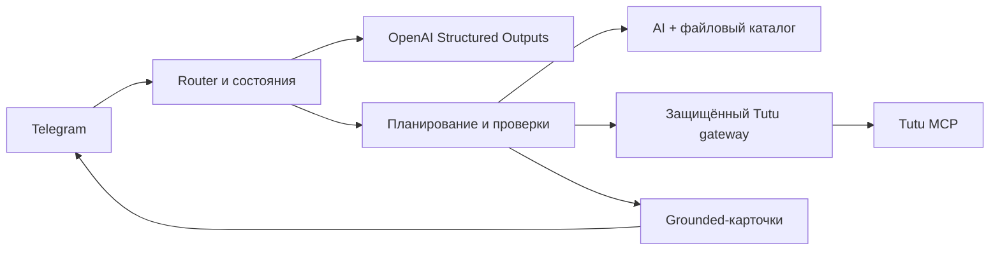

# «Ту-да и обратно»

> Telegram-ассистент для коротких поездок: от идеи «куда-нибудь на
> выходные» до конкретных билетов, отеля и плана по дням.

Бот понимает запросы на русском языке, помогает выбрать направление или проверить
готовый маршрут, сопоставляет транспорт и проживание через Tutu и объясняет
компромиссы по цене, времени и удобству. OpenAI используется для понимания свободного
текста и персонализации идей; расписание, доступность и стоимость не выдумываются
моделью, а проверяются через travel-провайдера.

Проект находится на стадии функционального MVP. Бот сопровождает пользователя до
перехода к оформлению, но не принимает оплату и не бронирует поездку внутри Telegram.

## Документация

- [Руководство пользователя](docs/USER_GUIDE.md) — первый запуск, команды,
  пользовательский путь, примеры запросов и границы возможностей.
- [Техническая документация](docs/TECHNICAL_GUIDE.md) — архитектура, интеграции,
  конфигурация, локальный запуск, тестирование, безопасность и CI/CD.

## Возможности MVP

- `/ideas` — вдохновение и подбор неизвестного направления под даты, интересы,
  темп, бюджет и допустимую дорогу;
- `/newtrip` — проверка готового маршрута с конкретным городом назначения;
- свободный русский текст и уточняющие вопросы только по недостающим параметрам;
- конкретные варианты транспорта туда и обратно, отель и предварительная стоимость;
- до трёх разных поездок с объяснением сильных сторон и альтернатив по цене/скорости;
- программа на каждый день без повторения одного места внутри поездки;
- поисковые ссылки на места в Яндекс Картах и, когда доступны, точные ссылки Tutu;
- изменение пожеланий, повторная проверка цен, privacy- и feedback-сценарии;
- polling для локальной разработки и защищённый webhook для production.

Подбор неизвестного направления пока пилотируется для выезда из Москвы. Готовый
маршрут из другого города можно проверить через `/newtrip`.

## Как устроено решение



Проект реализован как модульный Python-монолит с портами и адаптерами. LLM отвечает
за понимание свободного текста, нормализацию названий городов, идеи и формулировки,
а доменный слой — за даты, уникальность, совместимость, бюджет, ranking и остальные
проверяемые инварианты. Такой баланс сохраняет гибкость диалога без передачи модели
контроля над фактами и деньгами.

## Быстрый локальный запуск

Требования: Python 3.11–3.14, Telegram bot token и OpenAI API key.

```bash
python3.11 -m venv .venv
source .venv/bin/activate
python -m pip install -r requirements.lock
python -m pip install --no-deps -e .
cp .env.example .env
```

Заполните локальный `.env`, не добавляя его в Git:

```dotenv
TELEGRAM_BOT_TOKEN=...
OPENAI_API_KEY=...
OPENAI_MODEL=gpt-5.6-sol
BOT_TRANSPORT=polling
```

```bash
python -m app.main
```

Проверка изменений:

```bash
python -m ruff check app tests scripts
python -m ruff format --check app tests scripts
python -m pytest --cov=app
```

Подробные параметры окружения, Docker, webhook, Cloud Run и release flow описаны в
[технической документации](docs/TECHNICAL_GUIDE.md).

## Статус и ответственность

Цены и наличие актуальны на момент поиска и могут измениться до оформления. Переход
по ссылке не резервирует место. Идеи AI, часы работы достопримечательностей и расходы,
не подтверждённые провайдером, явно отделяются от проверенных данных.

В развитии после MVP: новые города отправления, внешнее хранилище состояния и feedback,
горизонтальное масштабирование, live AI-evals, события, уведомления об изменении цены и
сквозная аналитика от рекомендации до бронирования.
